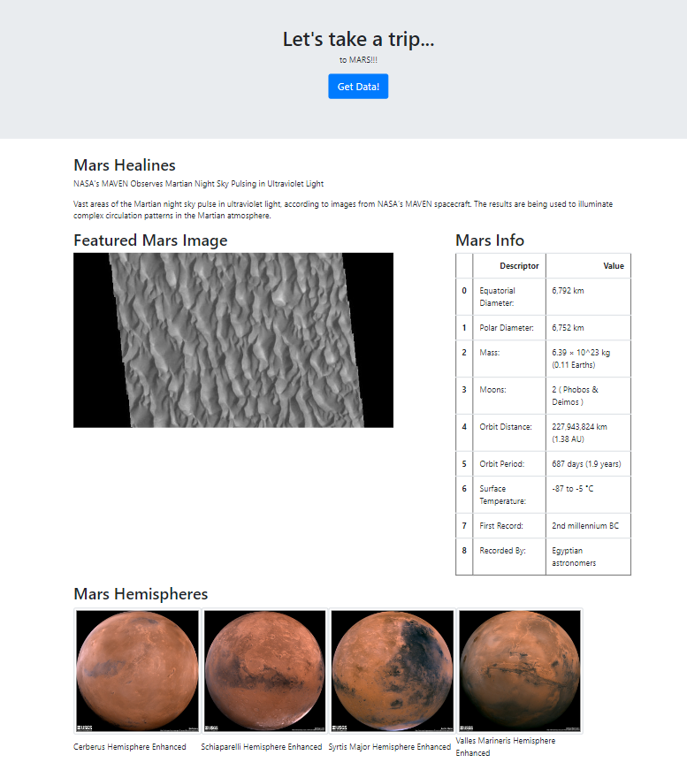

# Web-Scraping-Challenge

## Description

The purpose and motivation of this project was multifaceted. I coded a python program to scrap information from a few websites. This information was then placed inside a function that, when run, would scrape information from these sites. This informations was then stored and flask was used to render the information on a webpage. This project allows us to compile information from several sites and place them on a single, custom website. 

## Usage

The site was deployed locally and the following snapshot shows what the site looks like after pressing the "Get Data!" button. Each time the button is pressed, a new headline and paragraph are shown along with images and a table giving information about the red planet. 

